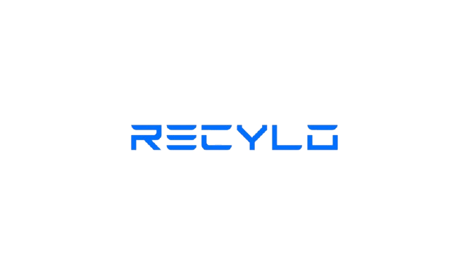
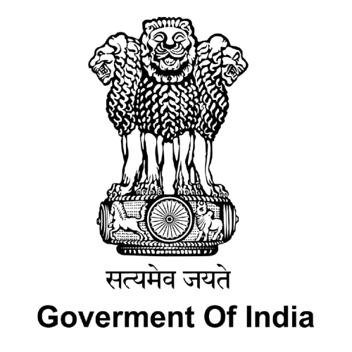
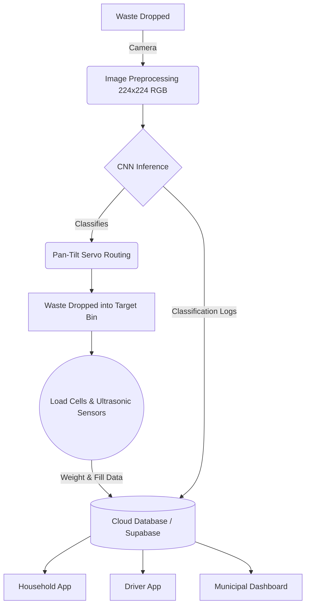

<div align="center">
  
</div>

<br/>

<div align="center">
  
  
  
  
  
</div>
<br/>

<div align="center">
  
  
  
  
  
  
  <br/>
  
  
  
  
  
  
</div>

<br/>

[](https://opensource.org/licenses/MIT)

 
**Live Technical Preview:** [See Live Demo and site](https://ishaaqdev.github.io/Recylo-SIH/)

---

## The Story: Our 120-Hour Hackathon Journey

This project was developed during the **Smart India Hackathon (SIH)**, from **Dec 9, 2025 to Dec 12, 2025**. For 120 grueling hours, our team worked tirelessly in a rigorous 5-day hardware and software hackathon at our nodal centre: **GIET Gunupur, Odisha**. 

We didn't just build a device; we built an entire ecosystem to tackle India's waste management crisis from the ground up. To make our AI incredibly robust and context-aware, **we collected real-world data directly from the venue**. This meant scanning and analyzing India-specific brands, wrappers, and products, ensuring our model was tuned to the exact waste it would encounter in real-life Indian environments.

**Design Registration & Patent Info:**
- **Design Application No.:** 482604-001 (Filed on 4th December 2025)
- **Title:** Waste segregation device
- **Class:** 15, Sub-class: 99
- **Applicant:** BGS College of Engineering and Technology (BGSCET)

---

## Problem Statement

- **Problem Statement ID:** 25046
- **Problem Statement Title:** Smart Waste Segregation and Recycling System
- **Description:** Design an IoT-enabled waste segregation system using sensors and machine learning to automatically classify household waste (organic, recyclable, hazardous) at the source. The system should integrate with municipal waste management for efficient collection and recycling.
- **Expected Outcome:** A prototype device with 90% accuracy in waste classification, coupled with a mobile app for households to monitor waste disposal and earn incentives for recycling.
- **Technical Feasibility:** Uses affordable sensors (e.g., cameras, weight sensors) and ML models (e.g., convolutional neural networks) for waste identification, deployable in urban and semi-urban areas.
- **Organization:** Government of Odisha
- **Department:** Electronics & IT Department
- **Category:** Hardware
- **Theme:** Clean & Green Technology

---

## Project Structure

```text
recylo/
├── ai/                     # AI Inference Logic & ONNX Models
├── app/                    # Unified React Application (Citizen/Driver/Admin)
├── hardware/               # Raspberry Pi 5 / GPIO & Servo Control Logic
├── docs/                   # Project Documentation & Static Assets
│   ├── index.html          # Technical Showcase Website
│   ├── Certificates/       # Patent & Registration Certificates (PDF)
│   ├── Demo_Video.mp4      # Project Demonstration Video
│   └── images/             # UI Mockups & Hardware Imagery
└── README.md               # Main Repository Documentation
```

## System Architecture & Workflow

For detailed hardware pin mappings, see [Hardware Connections](docs/hardware_connections.md).


### 1. The Machine Learning Model (AI)
The core of our segregation system relies on a Convolutional Neural Network (CNN). We utilized a MobileNet V2 / ResNet-based architecture optimized for edge devices.
- **Preprocessing:** The Raspberry Pi Camera captures a high-resolution RGB image. We preprocess this by resizing the frame to 224x224 and normalizing the pixel values.
- **Inference:** We export our trained model to an `.onnx` format (`waste_classifier.onnx`). Using `onnxruntime`, the Raspberry Pi performs local inference in milliseconds without needing an internet connection.
- **Classification:** The model classifies the waste into one of 10 highly specific sub-classes (e.g., cardboard, biomedical, e-waste) which are then logically mapped to the 4 main physical bins (Recyclable, Non-Recyclable, Organic, Hazardous).

### 2. The Hardware (Physical Device)
The Raspberry Pi 5 orchestrates the entire physical sorting mechanism. For a detailed list of GPIO pin mappings and connections, please see the [Hardware Connections Document](docs/hardware_connections.md).
- **Raspberry Pi 5:** Edge-computing unit.
- **Pi Camera Module (1080p):** Captures waste images.
- **Pan-Tilt Servo Motors:** Routes the waste.
- **Load Cells + HX711 ADC:** Gamifies the experience by tracking exact waste weight.
- **Ultrasonic Sensors (HC-SR04):** Measures compartment fill levels.
- **3.5-inch Touch LCD:** User interaction at the bin.

### 3. The Software (Web App)
Built on React and Vite, the software ecosystem is hosted in a single frontend repository but acts as three distinct portals via routing:
- **Citizen / User App** (`/`) - Gamified interface for users to track points and claim rewards.
- **Truck Driver App** (`/driver`) - Optimized routes and pickup logs for municipal drivers.
- **Municipal Dashboard** (`/municipal`) - Analytics and bird's-eye view of ward-level waste generation for city planners.

---

## How to Clone, Run, and Use

### Prerequisites
- Node.js (v18+)
- Python 3.9+

### Step 1: Clone the Repo
```bash
git clone https://github.com/ishaaqdev/Recylo-SIH.git
cd Recylo-SIH
```

### Step 2: Run the Web Apps (Localhost)
Navigate to the `app` directory to launch the web portals:
```bash
cd app
npm install
npm run dev
```
Access all three applications simultaneously on `http://localhost:5173`:
- **User App:** `http://localhost:5173/`
- **Driver App:** `http://localhost:5173/driver`
- **Municipal Dashboard:** `http://localhost:5173/municipal`

### Step 3: Run the Hardware / AI (Raspberry Pi)
```bash
cd hardware
pip install -r ../requirements.txt
python pipeline_runner.py
```

---

## Gallery
We have attached our design patent certificates and physical hardware build images (including our time at the venue) in the `/docs/images/` directory. Feel free to explore them!

---

## The Team

A massive shoutout to the incredible minds that made this possible in 120 hours:

- **Mohammed Ishaaq** <br>  [GitHub](https://github.com/ishaaqdev) &nbsp;|&nbsp;  [LinkedIn](https://www.linkedin.com/in/ishaaq42/)
- **D Karthik Raj** <br>  [GitHub](https://github.com/dkarthikraj) &nbsp;|&nbsp;  [LinkedIn](https://www.linkedin.com/in/d-karthik-raj-70b285326/)
- **Ullas M** <br>  [GitHub](https://github.com/ullasroxx) &nbsp;|&nbsp;  [LinkedIn](https://www.linkedin.com/in/ullas-m-naik/)
- **Hema B** <br>  [GitHub](https://github.com/hema004-pjt) &nbsp;|&nbsp;  [LinkedIn](https://www.linkedin.com/in/hema-b-2581b6301/)
- **Namratha N** <br>  [GitHub](#) &nbsp;|&nbsp;  [LinkedIn](https://www.linkedin.com/in/namratha-n-835937396/)
- **Nikhitha N** <br>  [GitHub](https://github.com/Nikhitha-38) &nbsp;|&nbsp;  [LinkedIn](https://www.linkedin.com/in/nikhitha-nagaraj-21b075373/)

---

**License:** This project is licensed under the [MIT License](LICENSE).
